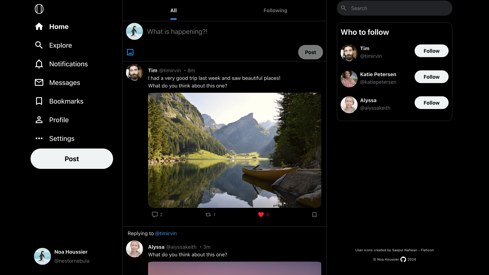

<a id="top"></a>

<div align="center">
    <a href="https://github.com/NestorNebula/odin-book">
        
    </a>
    
<h3>Odin-Book</h3>
</div>

## About



This project is a "clone" of a well-known social media site.

Users can log in using their GitHub account or with username/password. They can also have access to the website with limited features as guests.

Users can customize their profile, create posts and comment, like, repost and bookmark other users posts.

The website also supports private messages and real-time updates for notifications.

### Built With

[](https://nodejs.org/)
[](https://expressjs.com/)
[](https://www.postgresql.org/)
[](https://www.prisma.io/)
[](https://react.dev/)
[](https://vite.dev/)
[](https://vitest.dev/)
[](https://jestjs.io/)

#### AND

[](https://supabase.com/)
[](https://www.passportjs.org/)
[](https://socket.io/)
[](https://styled-components.com/)

## Getting Started

### Prerequisites

- NPM
- PostgreSQL database
- Supabase Storage DB
- GitHub App

### Installation

1. Fork the [Project repository](https://github.com/NestorNebula/odin-book)
2. Clone the forked repository to your local machine
   ```
   git clone git@github.com:<your username>/<repo name>.git
   ```
3. Update remote URL

   ```
   # SSH:
   git remote add upstream git@github.com:odin-book/<repo name>.git

   # HTTPS:
   git remote add upstream https://github.com/odin-book/<repo name>.git
   ```

4. Go to the server directory
   ```
   cd server
   ```
5. Create a .env file with the following keys

   ```
   // GitHub App keys
   CLIENT_ID
   CLIENT_SECRET
   CALLBACK_URL

   // Supabase DB Keys
   SUPABASE_PROJECT_URL
   SUPABASE_API_KEY

   // PostgreSQL DB
   DATABASE_URL
   TEST_DATABASE_URL (another DB, needed for testing)

   COOKIE_SECRET=<secret>
   PORT=<PORT>
   ORIGIN=<client_url>
   ```

6. Install required packages
   ```
   npm install
   ```
7. Go to the client directory and repeat the same process, this time with this key
   ```
   VITE_API_URL=<your_api_url>
   ```
8. Open the app in development mode
   ```
   npm run dev
   ```

If an error occurs, make sure you have done everything properly according to this guide. If you think so, you can <a href="https://github.com/NestorNebula/odin-book/issues">Open an Issue</a>.

## Usage

Once the app, the API and the db are running, you should be able to start the app locally.

## Contributing

If you find an issue within the app or want to contribute, you can <a href="https://github.com/NestorNebula/odin-book/issues">Open an Issue</a>.

## License

[](https://github.com/NestorNebula/odin-book/blob/main/LICENSE)

## Contact

Noa Houssier - [Github](https://github.com/NestorNebula)

## Acknoledgements

- [Material Design Icons](https://pictogrammers.com/library/mdi/)
- [Faker](https://fakerjs.dev/)
- [Supertest](https://github.com/ladjs/supertest)
- [date-fns](https://date-fns.org/)

<p align='right'>(<a href='#top'>go back to the top</a>)</p>
